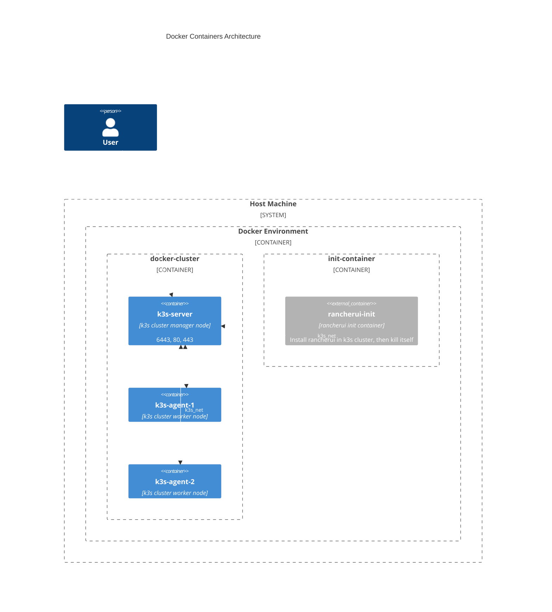

# Rancher/k3s cluster in docker containers

Learning how to deploy a simple 3 nodes (1 server and 2 agents) k3s cluster with rancher ui installed through a docker-compose.

## Environment

It's possible to define env variables in a .env file at the same level of the docker compose file.

ENV:
- **K3S_VERSION**: official rancher/k3s image version (default "v1.27.12-k3s1")
- **K3S_URL**: server url (obligatory)
- **K3S_TOKEN**: token to join the cluster (default "secret")
- **K3S_KUBECONFIG_OUTPUT**: file where to store kube conf file
- **K3S_KUBECONFIG_MODE**: set permissions on kube conf file
- **RANCHER_ADMIN_PASSWORD**: admin password for the first access to Rancher UI (default "admin")
- **RANCHER_DOMAIN**: valid DNS where to contact Rancher UI (default "rancher.local")

## Docker containers:

With

```bash
docker compose up
```

4 containers are going to go up:

- k3s-server
- k3s-agent-1
- k3s-agent-2
- rancherui-init

**k3s-server** and **k3s-agents** are going to form the cluster, **rancherui-init** it's like an init container that, when all the nodes and default pods are ready, will install cert-manager and rancher-ui in the cluster.


## TODO

CVE (3M) fix to implement for **sysperu/kubectl:main** image:

- [ ] CVE-2020-8552 k8s.io/apiserver 0.29.0
- [ ] CVE-2024-24786⁠ google.golang.org/protobuf 1.31.0
- [ ] CVE-2024-24557 github.com/docker/docker 24.0.7+incompatible

All regarding /usr/local/bin/helm

CVE (2H and 8M) fix to implement for **rancher/k3s:v1.27.12-k3s1** image.

Containers:
- [ ] Implement rootless mode in k3s docker containers
- [ ] Find a way to remove privileged flag in the compose file

