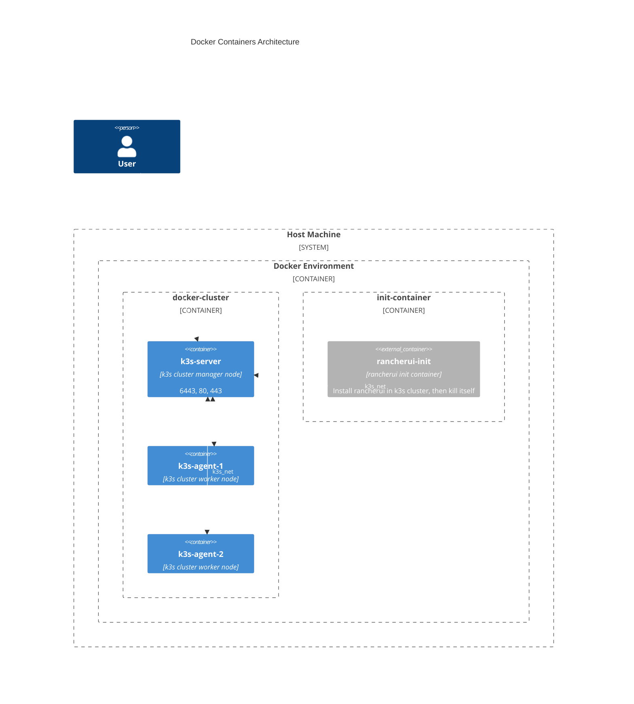

# Rancher/k3s cluster in docker containers

## How to use

Download the docker-compose.yml.

Then:

```
docker compose up
```

the operation can take a while.

To check the pods enter in the k3s-server container and run:
```
watch kubectl get pods --all-namespaces
```

## Environment

You can define environment variables in a .env file at the same level as the Docker Compose file.

ENV:
- **K3S_VERSION**: Official rancher/k3s image version (default "v1.27.12-k3s1")
- **K3S_URL**: Server Url (obligatory)
- **K3S_TOKEN**: Token to join the cluster (default "secret")
- **K3S_KUBECONFIG_OUTPUT**: File to store the kube config file
- **K3S_KUBECONFIG_MODE**: Permissions mode for the kube config file
- **RANCHER_ADMIN_PASSWORD**: Admin password for the initial access to the Rancher UI (default: "admin")
- **RANCHER_DOMAIN**: Valid DNS where the Rancher UI can be accessed (default: "rancher.local")

## Docker containers:

Four containers will be started:

- `k3s-server`
- `k3s-agent-1`
- `k3s-agent-2`
- `rancherui-init`

`k3s-server` and `k3s-agents` will form the cluster, while rancherui-init is an initialization container that will install Cert-manager and Rancher-UI in the cluster once all nodes and default pods are ready, without requiring privileged access.

## TODO

**CVE Fixec**

For the sysperu/kubectl:main image:

- [ ] CVE-2020-8552 k8s.io/apiserver 0.29.0
- [ ] CVE-2024-24786⁠ google.golang.org/protobuf 1.31.0
- [ ] CVE-2024-24557 github.com/docker/docker 24.0.7+incompatible

**Future Implementations**

For the rancher/k3s:v1.27.12-k3s1 image:

Containers:
- [ ] Implement rootless mode in k3s docker containers
- [ ] Find a way to remove privileged flag in the compose file

Regarding the last point, the privileged flag seems necessary in a containers in containers environment. However, it may be possible to replicate the same conditions without using it by mounting host directories inside the k3s containers, such as cgroup and kernel module directories in read-write mode. Additionally, more precise control can be achieved by adding cap_add options in the Docker Compose file.

